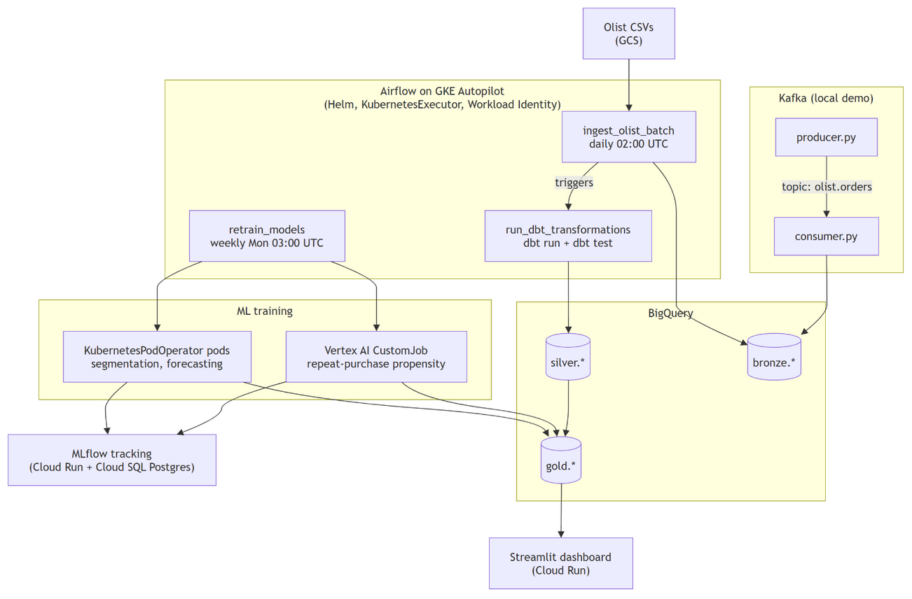
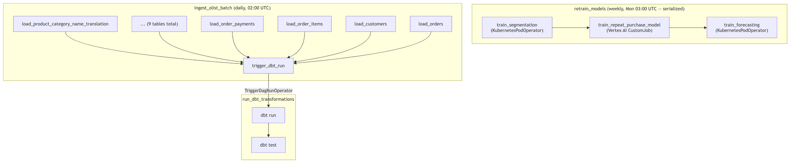
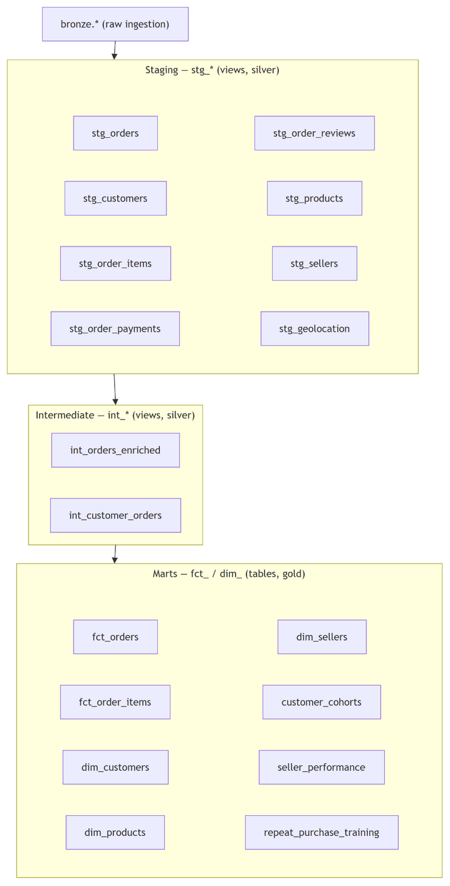

# DataPulse

An e-commerce analytics platform built on the Olist Brazilian E-Commerce dataset (100K orders, 9 source tables), running on managed GCP infrastructure: BigQuery, GKE Autopilot, Cloud Run, and Vertex AI. Airflow orchestrates ingestion, dbt transformations, and ML training end to end; a Streamlit dashboard on Cloud Run surfaces the results.

## Table of contents

- [Architecture](#architecture)
- [Tech stack](#tech-stack)
- [Repository layout](#repository-layout)
- [Airflow DAGs](#airflow-dags)
- [dbt transformations](#dbt-transformations)
- [Cloud setup](#cloud-setup)
- [Component reference](#component-reference)
- [Critical dataset gotchas](#critical-dataset-gotchas)
- [Local development](#local-development)

## Architecture



Airflow runs on a GKE Autopilot cluster (Helm, KubernetesExecutor). Auth throughout the GCP path is Workload Identity — no service-account keys, no `gcloud` CLI baked into any image. ML training runs either as KubernetesPodOperator pods on the same cluster (segmentation, forecasting) or as a Vertex AI CustomJob (repeat-purchase propensity) — a deliberate side-by-side comparison of both execution patterns. MLflow tracks every run against a Cloud Run service backed by Cloud SQL Postgres.

## Tech stack

| Layer | Technology |
|---|---|
| Orchestration | Apache Airflow 2.8 on GKE Autopilot (Helm, KubernetesExecutor, Workload Identity) |
| Streaming | Apache Kafka 3.x (Confluent images, Docker Compose — local-only demo) |
| Warehouse | Google BigQuery (`bronze` / `silver` / `gold` datasets) |
| Raw storage | Google Cloud Storage |
| Transformation | dbt Core 1.7+ (`dbt-bigquery`) |
| ML | XGBoost (repeat-purchase propensity), Prophet (forecasting), scikit-learn (K-means segmentation) |
| ML training execution | KubernetesPodOperator (segmentation, forecasting) + Vertex AI CustomJob (repeat-purchase) |
| Stats | SciPy + statsmodels (A/B testing) |
| Experiment tracking | MLflow (Cloud Run, Cloud SQL Postgres backend); XGBoost and K-means models are registered in the MLflow Model Registry on each training run |
| Dashboard | Streamlit + Plotly, deployed to Cloud Run |
| CI/CD | GitHub Actions (lint, tests, Docker builds, Helm validation, WIF-based Cloud Run deploy) |

## Repository layout

```
src/                          ← git root
├── airflow/dags/              # ingest_olist_batch, run_dbt, retrain_models, vertex_job
├── kafka/                     # producer.py, consumer.py (local streaming demo)
├── dbt/datapulse/             # Bronze → Silver → Gold transformations
│   └── models/{staging,intermediate,marts}/
├── ml/                        # repeat_purchase_model.py, segmentation.py, forecasting.py
├── ab_testing/                # ab_test.py, generate_ab_test_inputs.py
├── dashboard/                 # Streamlit app (app.py + pages/)
├── infra/
│   ├── terraform/              # GKE cluster, MLflow Cloud Run + Cloud SQL, IAM/Workload Identity
│   └── helm/                   # airflow-values.yaml, ml-training-ksa.yaml
├── mlflow_server/             # MLflow tracking server image
├── notebooks/                 # EDA notebooks
└── data/raw/olist/            # downloaded CSVs (gitignored)
```

## Airflow DAGs



- **`ingest_olist_batch`** loads each of the 9 Olist CSVs from GCS into `bronze.*` (`WRITE_TRUNCATE`), then triggers the dbt DAG.
- **`run_dbt_transformations`** runs `dbt run` then `dbt test` against the whole project, rebuilding `silver.*` and `gold.*`.
- **`retrain_models`** retrains all three ML models. The three tasks are deliberately serialized — segmentation and forecasting run as pods on the GKE cluster, while the repeat-purchase model is submitted as a Vertex AI CustomJob — kept sequential so they don't all hit the shared MLflow backend at once.

## dbt transformations



- **Staging (`stg_*`, views in `silver`)** — one model per source table: casts types, fixes column-name typos, deduplicates geolocation, aggregates payments to one row per order.
- **Intermediate (`int_*`, views in `silver`)** — joins staging models into order- and customer-level grain (e.g. RFM inputs per `customer_unique_id`); not exposed to BI tools.
- **Marts (`fct_*` / `dim_*`, tables in `gold`)** — fact and dimension tables plus purpose-built ML training tables (e.g. a leakage-safe forward-window table for the repeat-purchase model). Every PK has `unique`/`not_null` tests; every FK has a `relationships` test.

## Cloud setup

```powershell
# 1. Provision durable infra: GKE Autopilot cluster, MLflow Cloud Run + Cloud SQL, IAM/Workload Identity
cd infra/terraform
terraform init
terraform apply -var "project_id=YOUR_PROJECT_ID"

# 2. Deploy Airflow onto the cluster (Helm, KubernetesExecutor, Workload Identity)
cd ..
./deploy_airflow.ps1
kubectl port-forward svc/airflow-webserver 8080:8080 -n airflow   # UI at localhost:8080 (ClusterIP only)

# 3. Trigger the DAGs from the Airflow UI (or wait for their schedules):
#    ingest_olist_batch → run_dbt_transformations → retrain_models

# 4. Publish the dbt lineage graph (staging → intermediate → marts, with
#    column-level docs) as a static site:
cd dbt/datapulse
conda run -n datapulse_venv dbt docs generate --profiles-dir ..
gcloud storage rsync -r target/ gs://datapulse-dbt-docs-$env:GCP_PROJECT_ID
```

The published docs are served at the `dbt_docs_url` Terraform output.

The dashboard deploys independently via GitHub Actions: pushing to `main` under `dashboard/**` or `ab_testing/**` builds the image and deploys to Cloud Run using keyless Workload Identity Federation (no long-lived service-account keys). One-time setup for that pipeline is documented in `docs/wif_setup.md`.

Cloud infra follows a **destroy-when-idle** discipline — run `terraform destroy` from `infra/terraform/` when not actively using it, to avoid standing Cloud SQL / GKE Autopilot costs.

## Component reference

| Directory | Purpose |
|---|---|
| `airflow/dags/` | `ingest_olist_batch` (daily bronze load), `run_dbt_transformations` (dbt run/test), `retrain_models` (weekly ML training) |
| `dbt/datapulse/` | Bronze → Silver → Gold transformations, dbt tests, custom macros |
| `ml/` | Model training scripts: XGBoost propensity, K-means segmentation, Prophet forecasting; shared BigQuery/MLflow helpers |
| `ab_testing/` | Reusable statistical A/B testing module (proportion + continuous metrics), no BQ/MLflow dependency |
| `dashboard/` | Streamlit app: Overview, Customers, Propensity, A/B Test Runner, Forecasting pages |
| `infra/terraform/` | Durable cloud infra: GKE Autopilot cluster, MLflow Cloud Run + Cloud SQL, dbt docs static site bucket, service accounts, Workload Identity bindings |
| `infra/helm/` | Airflow Helm chart values, ml-training KSA manifest |
| `infra/vertex/` | Vertex AI CustomJobSpec template for the repeat-purchase training job |
| `mlflow_server/` | MLflow tracking server container (Cloud SQL Postgres backend) |
| `kafka/` | Local streaming ingestion demo — producer replays historical orders, consumer streams into BigQuery |
| `notebooks/` | Exploratory data analysis, reading exclusively from the Gold layer |

## Critical dataset gotchas

These are subtle bugs that produce silently wrong results if ignored — all are already handled in the dbt models and ML scripts, but matter if you extend this project:

1. **Customer identity** — `customer_id` is generated fresh per order, not per person. Always join through `stg_customers` and group by `customer_unique_id`.
2. **Payments fan-out** — `order_payments` has more rows than orders (split payments/instalments). Always `SUM(payment_value) GROUP BY order_id` before joining; `stg_order_payments` already does this.
3. **Geolocation duplicates** — ~261K duplicate zip codes; `stg_geolocation` deduplicates via `AVG(lat)/AVG(lng) GROUP BY zip_code_prefix`.
4. **Column typos in source** — the products table has `product_name_lenght`/`product_description_lenght` (missing "t"); `stg_products` fixes the spelling.
5. **Sparse reviews** — ~3% of orders have no review; always `LEFT JOIN` reviews to orders.
6. **Delivered orders with NULL delivery dates** — 775 rows; flagged with `is_delivery_date_missing` rather than dropped.
7. **`is_inactive` vs. `will_repeat`** — `dim_customers.is_inactive` is a BI snapshot flag (recency > 90 days); the ML model's label is `will_repeat` from `gold.repeat_purchase_training`, a leakage-safe forward-window label. Olist is ~97% one-time buyers, so `will_repeat = true` is the minority class.

## Local development

Everything below runs on your machine without touching the cloud infra above — useful for iterating on dbt models, ML scripts, or the dashboard without a live GKE cluster.

**Prerequisites:** conda environment `datapulse_venv` active for all Python commands; `pip install -r requirements-ml.txt` (+ `requirements-dev.txt` for linting); a `.env` file at the project root (see `.env.example`); Olist CSVs downloaded to `data/raw/olist/`.

**Kafka streaming demo**

```powershell
docker compose up -d
conda run -n datapulse_venv python kafka/producer.py
conda run -n datapulse_venv python kafka/consumer.py
```

Producer replays 2 years of order history onto topic `olist.orders` at `localhost:9092`; consumer writes to `bronze.orders_stream`. Kafka UI: `http://localhost:8090`.

**dbt, run locally**

```powershell
cd dbt/datapulse
conda run -n datapulse_venv dbt run --profiles-dir ..
conda run -n datapulse_venv dbt test --profiles-dir ..

# Preview the lineage graph + column docs locally, without publishing to GCS
conda run -n datapulse_venv dbt docs generate --profiles-dir ..
conda run -n datapulse_venv dbt docs serve --profiles-dir ..
```

**ML models, run locally**

```powershell
cd ml
conda run -n datapulse_venv python repeat_purchase_model.py   # → gold.customer_repeat_purchase_scores, gold.repeat_purchase_feature_importance
conda run -n datapulse_venv python segmentation.py             # → gold.customer_segments
conda run -n datapulse_venv python forecasting.py               # → gold.demand_forecasts
```

**A/B testing**

```powershell
cd ab_testing
conda run -n datapulse_venv python generate_ab_test_inputs.py   # prints ready-to-paste control/variant arrays from gold.*
conda run -n datapulse_venv pytest test_ab_test.py
```

**Dashboard, run locally**

```powershell
pip install -r dashboard/requirements.txt
$env:PYTHONPATH = "."
conda run -n datapulse_venv streamlit run dashboard/app.py
```
